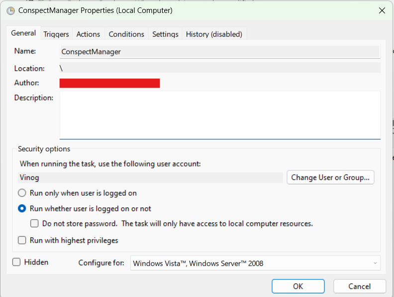
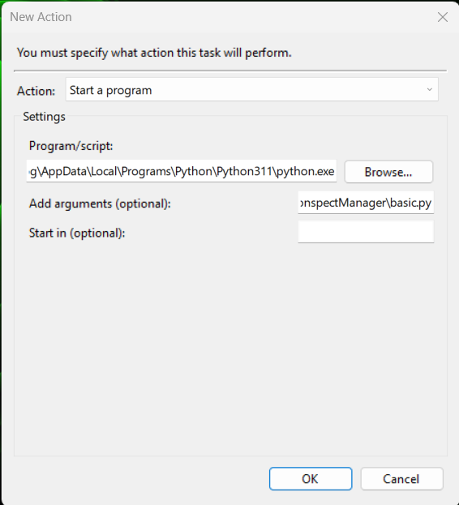
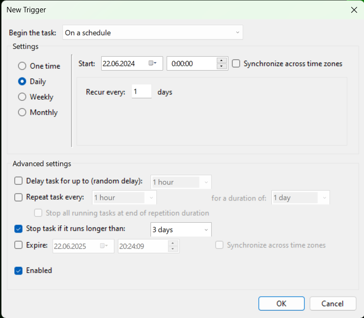
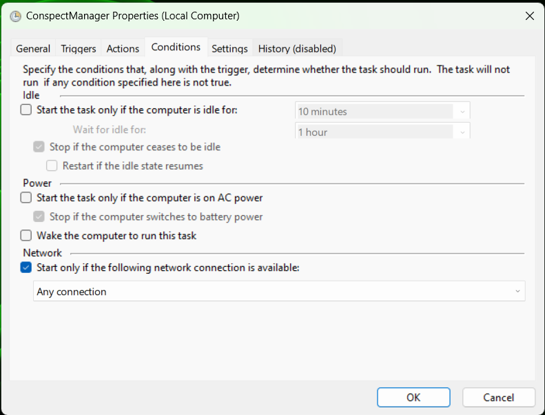
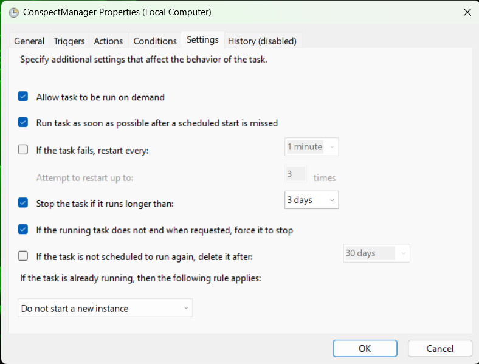

# ConspectManager

Manager for markdown notes written in `Visual Studio Code`

## Description

Collect notes from all the lectures (by paths provided), add files and images and push them respectfully to different branches of your Git repository with lecture notes

## How to write lecture notes

Use `Visual Studio Code` and Markdown to write notes from online lectures effectively

1. Markdown allows you to add `LaTeX` formulas directly to the text (it is easier than any other `LaTeX` tools)

2. `Visual Studio Code` allows you to save images (screenshots) fast just by pressing `Ctrl+V` to place an image in the note (image file will be saved in the same folder)

This tool is used to upload new notes and manage image files

1. `DEFAULT` variant uploads your notes as you saved them

2. `PRETTIER` variant places all the image screenshots to `/images` folder and also helps you to avoid filename collisions

## Config setup

Create `config.json` file in project root and fill it the same way as `config.json.example`

`Repo` field must have `.git` in the end

`Personal access token` can be created in Github settings (make sure it can access private repositories and workflows)

For each branch in `Branches` provide a name of a subject and an **absolute** path to the folder, where your notes are saved 

`WARNING:` do not use `\\` separator for Windows, change it with `/`

## Test run

1. Check that Python is installed in your OS

2. Clone this repository

```bash
git clone https://github.com/BiscuitsLayer/ConspectManager.git
```

2. Go to the project root, setup virtual env and install requirements

```bash
cd ./ConspectManager

# Create and activate venv
python -m venv env
. ./env/Scripts/activate

# Install requirements
pip install -r requirements.txt
```

3. Make sure you filled `config.json` in the project root correctly

4. Run the main file

```bash
python basic.py
```

5. Open `basic.log` and check that push was done correctly - it must contain these messages for every `COURSE_NAME`

```
DATE TIME; COURSE_NAME; INFO; DEFAULT: push done
DATE TIME; COURSE_NAME; INFO; PRETTIER: push done
```

## Windows Scheduler setup

1. Open `Windows Task Scheduler` and create new task called `ConspectManager`

2. Choose `Run whether user is logged on or not`



3. Go to `Actions` -> `New` and choose Python interpreter in virtual env as a program/script and `basic.py` file of current project as an argument

    On my PC Python interpreter in virtual env path is 

    `C:\Users\Vinog\Downloads\ConspectManager\env\Scripts\python.exe`

    And `basic.py` file path is

    `C:\Users\Vinog\Downloads\ConspectManager\basic.py`



4. Go to `Triggers` -> `New` and set up the time you want your notes to be checked and uploaded (I set it to `0:00:00` daily)



5. Go to `Conditions` and allow task to start only when network connection is available



6. Go to `Settings` and choose `Run task as soon as possible after a scheduled start is missed`



## Linux Scheduler setup

On Linux `crontab` should be used for scheduling task (maybe I will add detailed instructions later)
