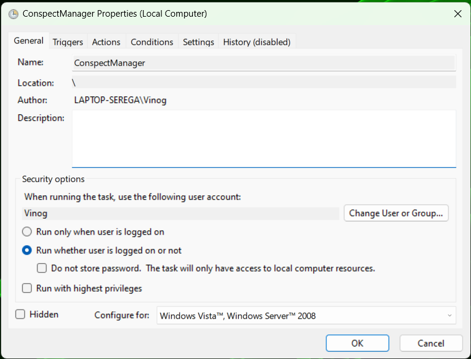

# ConspectManager

Collect notes from all the lectures (by paths provided), add markdown files and images and push them respectfully to different branches of your Git repository with notes

## Windows setup

1. Open `Windows Task Scheduler` and create new task called **ConspectManager**

2. Choose `Run whether user is logged on or not`

3. Go to `Actions` -> `New` and browse to the `main.py` file of current project

4. Go to `Triggers` -> `New` and set up the time you want your notes to be checked and uploaded
 